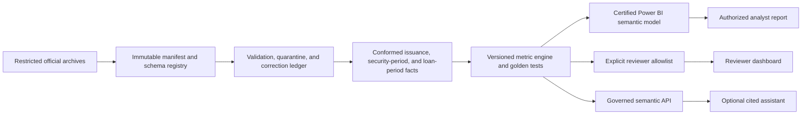

# Architecture decision

## Approved status

- **Current architecture:** governed local issuance product plus restricted M4 facts and supported M5 metric components
- **Next architecture:** complete M5 approval gates, then build the certified Power BI semantic model over M4/M5
- **Data access:** authorized row-level Freddie Mac source use; restricted files stay outside Git and reviewer artifacts
- **Retention:** seven years from acquisition, deleted earlier if authorization ends
- **Current cost:** $0 operating baseline
- **Cloud/AI/deployment/publication:** not approved

## Verified baseline

```text
Authorized FRE_IS ZIPs
  → exact package/schema/period validation
  → row rules, exclusions, duplicate detection, reconciliation
  → restricted SQLite facts + manifest + value-free quality events
  → all-pass publication gate
  → versioned aggregate JSON
  → local static issuance dashboard
```

The verified build processes 60,604 physical rows from 19 files and publishes 59,904 issuance observations after 700 documented exclusions, with zero rejected and duplicate rows.

## Verified M4 conformance

```text
106 restricted monthly-security/loan archives
  -> cached exact package/member/schema/layout/period inventory
  -> streaming value/type/key validation and immutable manifests
  -> 9,240,038 SQLite security-period facts
  -> 35 compressed period/source loan partitions with 264,922,553 facts
  -> reason-coded joins, correction/as-of lineage, and aggregate reconciliation
```

The M4 build reconciles 693,640,933 physical rows to 274,162,591 accepted/published facts and 419,478,342 explicit supplemental exclusions. Zero rows are rejected, duplicated, or quarantined. All loan joins match in the acquired population. Backfill and unchanged incremental runs produce the same normalized snapshot checksum.

## Verified M5 supported engine

```text
M4 SQLite security facts + compressed loan partitions + governed issuance facts
  -> resolved 54-contract metric catalog
  -> partition-local streaming additive/weighted components
  -> cross-partition security/loan/segment/portfolio reconciliation
  -> restricted local SQLite metric store
```

All 23 currently supported contracts are implemented. The engine scans 264,922,553 loan rows and both 9,240,038-row security correction views with 32,538,624 bytes measured peak RSS. It emits 256,461 released components and 240 explicitly unreleased candidates. Full and unchanged incremental runs share checksum `54e128d0590f8e7c4ed1396c0d3626cb56b08390b670d10a5fbf184b15ed6341`; 684 segment and weighted-component parity checks pass.

## Target logical architecture



Identity, access, secrets, audit, observability, cost, backup, recovery, deployment, and teardown govern cloud components only after approval.

## Data architecture

| Layer | Grain / responsibility | Required controls |
| --- | --- | --- |
| Restricted landing | immutable acquired archive | checksum, member inventory, acquisition time, retention/deletion clock |
| Validated staging | streaming native source row/record type | schema validity, type/range rules, correction identity, disposition reconciliation; accepted rows are not duplicated into a wide staging copy |
| Conformed facts | issuance security, SQLite security-period, compressed period/source loan-period partitions | source keys, immutable partition checksums, original/latest rules, matched/unmatched reason taxonomy |
| Metric engine | numerator/denominator components and certified measures | formula version, golden fixtures, comparison eligibility, limitation |
| Semantic model | star schema facts/dimensions and explicit measures | single-direction relationships, security classification, parity/performance tests |
| Release models | authorized detail or explicit reviewer aggregate | independent allowlist, negative access tests, artifact inspection |

Do not flatten security-period and loan-period data into one wide fact table. Weighted measures must carry additive numerator and denominator components. Classic FICO and VS4 remain separate score systems. The April 2026 file consolidation is modeled as source metadata, not an economic event.

## Correction and as-of design

- Append immutable source versions and retain provider correction indicators.
- Provide `As reported` and `Latest known` views.
- Record affected row count, UPB, fields, source version, load time, and precedence reason.
- Never overwrite evidence of an original publication.
- Rebuilds and incremental loads must agree for the same as-of view.

## Power BI design

- Local Power BI Desktop Import model is the initial target.
- Star schema uses explicit measures and conformed dimensions defined in `docs/BI_PRODUCT_SPEC.md`.
- Incremental refresh is introduced only after range-boundary, late-arriving, and correction tests pass.
- Field parameters provide controlled metric/segment selection; they do not grant arbitrary field access.
- Row-level and object-level security, export restrictions, Build permissions, and workspace roles are implemented and tested only when Power BI Service is approved.
- The current static dashboard remains the release baseline until Power BI metric parity, accessibility, stakeholder tasks, and rollback evidence pass.

## Technology choices and triggers

| Choice | Use now | Scale/change trigger |
| --- | --- | --- |
| Python governed transformations | Yes | Keep; package/containerize when dependencies or scheduling require it |
| SQLite control/security facts plus compressed loan partitions | Yes; avoids a disk-unsafe 264.9M-row wide SQLite loan table | Move only when M5/M6 query/performance evidence justifies a governed analytical engine |
| Power BI Import semantic model | M6 target | Composite/DirectQuery only with measured size, latency, or freshness need |
| Static reviewer payload | Yes | Replace only with an approved reviewer semantic model/API |
| Semantic API | M9 | Required before any AI or non-BI client |
| AI assistant | No | M10 evidence plus explicit AI and cost approval |

## Cloud reference option

Azure remains a reference mapping, not a platform decision or provisioning authority:

| Capability | Reference service |
| --- | --- |
| Restricted landing/curated storage | ADLS Gen2 |
| Monthly containerized transformations | Container Apps Jobs with event/schedule orchestration |
| Governed serving | materialized products first; authenticated Functions/API when justified |
| BI identity and service | Power BI/Fabric tenant controls plus Microsoft Entra ID, subject to licensing approval |
| Secrets and telemetry | Key Vault, managed identities, Application Insights/Log Analytics |
| Delivery | reviewed GitHub Actions and Bicep |
| Optional AI | Azure OpenAI/AI Foundry plus approved retrieval, after M10 gate |

Provider, tenant, region, residency, tiers, cost ceiling, identity, backup, recovery, and teardown require explicit recorded approval before implementation.

## Claim boundary

Current claims include issuance, M4 conformance, and the 23 supported M5 contracts for release trust, issuance/balance, factor, age/maturity, score-model-separated credit, delinquency distributions, modification/deferral components, geography, and counterparty composition. Methodology-gated speed, transition, bridge, composite-quality, modification-rate, and HHI measures remain unreleased. Field-extension, external, Power BI, investigation, API, AI, cloud, and hosted-release claims remain absent.
