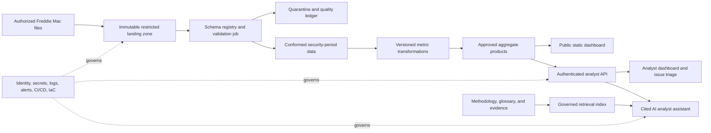

# End-to-end product refinement plan

Status: `approved for milestone-by-milestone implementation by project owner on 2026-08-09`

Prepared: 2026-08-09  
Evaluation lenses: senior MBS/data analyst, AI architect, cloud architect, product-delivery reviewer

## 1. Product goal

Build **Freddie Mac MBS Disclosure Intelligence**: a governed analyst workflow that converts authorized Freddie Mac security-level disclosures into traceable issuance, composition, factor, balance/runoff, prepayment, revision, and disclosure-quality monitoring. The product should help an operations or market-data analyst identify what changed, determine whether the change is data-related or market-related, inspect the supporting evidence, and document the next investigation.

The finished product has two deliberately separated release modes:

1. **Reviewer/public mode:** a static, accessible dashboard built only from an explicitly approved aggregate payload. No restricted raw files or security-level rows are published.
2. **Authorized analyst mode:** an authenticated application with governed drill-down, source lineage, issue triage, and an optional cited AI assistant. This mode is deployed only after cloud, cost, security, and data-publication approvals.

### Primary stakeholder and decisions

Primary stakeholder: MBS disclosure operations or market-data analyst.

The workflow must support these decisions:

- Is the latest disclosure complete, structurally valid, timely, and comparable with prior periods?
- Where did issuance volume, security count, and approved product mix change materially?
- Which changes reflect source corrections, schema changes, missing data, or duplicate data?
- After monthly factor sources are integrated, where did balances/factors move and which cohorts merit investigation?
- Which observations are verified facts, which are derived measures, and which are hypotheses requiring follow-up?

### Non-goals

- Borrower-level decisioning or use of personally identifiable information.
- Security valuation, trading, hedging, investment recommendations, or causal market claims.
- LLM-generated calculations, unrestricted text-to-SQL, autonomous alerts, or automated external actions.
- Publishing restricted Freddie Mac source files or security-level rows.
- Cloud provisioning, spending, deployment, or public release without recorded owner approval.

## 2. Current-state evaluation

### Evidence-backed strengths

- Nineteen authorized official issuance ZIP files cover 2024-12 through 2026-06.
- The pipeline loads 59,904 security observations and publishes 19 monthly aggregate rows.
- Source names, SHA-256 checksums, load timestamps, and record counts are stored locally.
- The released dashboard payload is aggregate-only and sample verification is non-destructive.
- `npm run check` passes three tests, the payload validator, and the current project-record check.
- The static dashboard has a restrained business narrative, responsive layout, semantic structure, and a keyboard skip link.
- The operating baseline is local and $0; no paid or public resource exists.

### Material gaps and risks

| Priority | Gap | Product consequence |
| --- | --- | --- |
| Critical | No Git repository is present in the workspace. | CI, revision lineage, controlled release, rollback, and deployed-SHA evidence cannot be trusted. |
| Critical | `.project/data.md`, `.project/evaluation.md`, and `CASE-STUDY.md` are absent. | Data rights/field rules, success metrics, and recruiter-facing claims lack complete contracts. |
| High | Invalid official ZIP rows are silently skipped. | Published totals can be incomplete without a visible failure or reconciliation record. |
| High | No accepted/rejected/duplicate accounting exists. | Source quality and aggregate lineage cannot be defended end to end. |
| High | Source schema changes are not versioned. | A disclosure format change can pass partial header checks while silently changing analytical meaning. |
| High | The observed header profile changes beginning with `FRE_IS_202512.zip`. | The pipeline needs explicit schema-version detection and compatibility tests before broader field use. |
| High | Findings hard-code March/April 2026 and assume a fixed story. | A normal data refresh can make product copy false. |
| High | The factor chart is analytically uninformative in the issuance-only dataset (`average_factor` is 1.0 in the latest aggregate). | It suggests analytical scope the current sources do not provide. |
| High | CI checks only the project-record script. | Tests, released-payload validation, accessibility, and static preview are not protected on changes. |
| Medium | Fetch failure produces an unhandled rejected promise; explicit loading, empty, and error states are absent. | The reviewer experience fails unclearly when the payload is missing or malformed. |
| Medium | Chart labels omit years and the SVG is hidden from assistive technology without an equivalent generated summary. | Cross-year comparison and accessibility are weaker than the visual design implies. |
| Medium | No issuance-mix segmentation or security/cohort drill-down exists. | The product shows trend direction but not composition or investigation paths. |
| Medium | No cloud, identity, observability, backup, IaC, or environment strategy exists. | The prototype is not deployable as an authorized multi-user product. |
| Medium | No AI capability or AI evaluation contract exists. | AI value, safety, grounding, cost, and operating boundaries are undefined. |

### Maturity score

This is a product-maturity assessment, not the project-kit's structural-readiness score.

| Dimension | Weight | Current | Rationale |
| --- | ---: | ---: | --- |
| Business problem and analyst workflow | 15 | 10 | Clear issuance question and operational framing; no issue-triage workflow yet. |
| Data rights, quality, and lineage | 15 | 7 | Authorized files and checksums exist; reconciliation and complete data contract do not. |
| Analytical depth and methodology | 15 | 5 | Issuance totals are valid; mix, factor, runoff, and prepayment are not implemented. |
| Engineering and verification | 15 | 7 | Small reproducible pipeline and three passing tests; limited failure coverage and no repository history. |
| Product UX and accessibility | 10 | 5 | Good visual baseline; missing states, year context, accessible chart narrative, and drill-down. |
| Cloud, reliability, and operations | 10 | 1 | Local preview only. |
| AI architecture and evaluation | 10 | 0 | Not implemented or contracted. |
| Security and governance | 5 | 2 | Aggregate-only public boundary is sound; identity, threat model, secrets, and scanning are absent. |
| Release evidence and case study | 5 | 1 | Portfolio record exists; case study, Git history, deployment evidence, and publication plan do not. |
| **Total** | **100** | **38** | **Credible local prototype; not yet a production or AI-enabled product.** |

The project-kit structural assessment is 70/100 because seven of ten expected record groups exist. The two scores answer different questions.

## 3. Target product capabilities

### Analyst experience

1. **Release health:** show expected/received files, schema version, accepted/rejected/duplicate rows, correction counts, source-period match, and freshness.
2. **Issuance monitor:** trend issuance UPB and security count, compare month over month and year over year when comparable history exists, and surface data-derived peaks/troughs.
3. **Composition monitor:** segment by one approved business taxonomy (begin with Prefix-to-product mapping only after definition and review).
4. **Factor and balance monitor:** after source integration, calculate observed factor change, current UPB movement, paydown/runoff, and cohort roll-forwards.
5. **Prepayment monitor:** implement only a documented and tested measure supported by the acquired fields and timing; clearly separate observed paydown from modeled interpretation.
6. **Evidence drill-down:** every metric links to period, source family, input count, quality status, calculation version, and limitation.
7. **Issue triage:** analysts can label an observation as source-quality, comparability, expected movement, or follow-up required and export an investigation note.
8. **Cited assistant (optional):** answer approved analytical questions using the metric API and project documentation, with citations and refusal behavior.

### Public/reviewer experience

- Approved monthly and mix aggregates only.
- Plain-language business question, findings, methodology, limitations, architecture, and reproducibility path.
- Loading, empty, error, stale-data, and partial-data states.
- Keyboard support, accessible tables and chart summaries, color-independent meaning, and responsive design.
- No authenticated analyst drill-down, raw data, free-form SQL, or AI endpoint unless separately approved.

## 4. Recommended target architecture

The architecture is intentionally progressive. The local pipeline remains the reference implementation until the cloud gate is approved.

### Cloud reference option: Azure-first, approval-gated

This is a proposal, not authorization to provision resources.

| Capability | Recommended service | Reason and scale boundary |
| --- | --- | --- |
| Restricted landing/curated storage | Azure Data Lake Storage Gen2 | Immutable raw zone, lifecycle rules, encryption, and controlled access. |
| Event and batch orchestration | Event Grid + Azure Container Apps Jobs | Monthly workload does not justify a continuously running cluster. |
| Transform/runtime | Versioned Python container | Reuses current logic while allowing pinned dependencies and repeatable execution. |
| Curated query/serving | Materialized aggregate files first; Azure Functions API for governed queries | Lowest credible cost for current scale. Introduce a managed analytical database only when concurrency or query complexity proves the need. |
| Public UI | Azure Static Web Apps | Static aggregate release, preview environments, headers, and inexpensive hosting. |
| Authorized UI/API identity | Microsoft Entra ID | Role-based access for analyst mode. |
| Secrets and encryption | Key Vault + managed identities | Avoid secrets in code or CI variables where workload identity is available. |
| Observability | Application Insights + Log Analytics | Job, API, data-quality, latency, error, and cost telemetry. |
| AI, only after M7 gate | Azure OpenAI/AI Foundry + Azure AI Search | Cited retrieval plus tool calls to deterministic metrics; no LLM calculations. |
| Delivery | GitHub Actions + Bicep | Tested revision-to-environment lineage and reproducible infrastructure. |

AWS or another approved cloud can implement the same logical boundaries. The platform decision belongs in the architecture approval gate; the product should not couple metric definitions to a vendor.

### Cost strategy

1. **Current/local:** $0 operating baseline; authorized raw processing stays local.
2. **Public demo:** static hosting plus an approved aggregate payload; target free tier. No AI endpoint.
3. **Authorized cloud pilot:** serverless monthly jobs, object storage, authenticated API, and basic monitoring. Record a monthly cost ceiling before provisioning.
4. **AI pilot:** opt-in, rate-limited, budget-capped, and enabled only when offline evaluation demonstrates incremental analyst value.

No numerical cloud-cost claim should be published until the selected region, service tiers, expected usage, and current prices are verified.

## 5. AI architecture and safety contract

AI is an enhancement, not the calculation engine. It begins only after data quality, metric definitions, and evidence APIs are stable.

### Allowed AI behavior

- Translate an analyst question into calls to allowlisted metric and evidence endpoints.
- Summarize returned aggregates and quality flags.
- Retrieve definitions, methodology, limitations, and source-lineage records.
- Cite metric version, period, evidence record, and supporting documentation.
- Recommend an investigation path while labeling it as a hypothesis.

### Prohibited AI behavior

- Calculate financial metrics from raw prose or invent missing data.
- Query arbitrary tables or receive raw restricted disclosure rows.
- Make trading, valuation, hedging, lending, or causal recommendations.
- Hide uncertainty, quality failures, stale data, or missing citations.
- Execute external actions or alter source/curated data.

### AI controls

- Tool-only access to a governed semantic/metric API; no unrestricted SQL.
- Retrieval allowlist and document-version metadata.
- Prompt-injection tests for source documents and user input.
- Structured response schema with facts, citations, limitations, and follow-up questions.
- Trace redaction, retention limits, rate limits, cost budgets, and kill switch.
- Human-visible feedback and a reviewed golden evaluation set.

Candidate AI exit thresholds, subject to evaluation-contract approval:

- 100% exact metric agreement on the deterministic golden set.
- At least 95% grounded-answer pass rate and 98% citation precision.
- At most 1% unsupported material-claim rate.
- 100% refusal/redirect pass rate on prohibited recommendation prompts.
- No raw restricted fields in prompts, traces, citations, or responses.
- Measurable reduction in analyst investigation time against the non-AI workflow.

## 6. Milestone-by-milestone delivery plan

M0 and M1 are preserved as completed historical milestones. The plan below proposes a controlled expansion of the existing roadmap. Implementation must stop at each approval gate.

### M0 — Verified real-data baseline

Status: `completed`

Outcome: official issuance ZIP ingestion, local SQLite, aggregate payload, and static dashboard are reproducible.

Preserve evidence: E-001 through E-003 and the verified 19-file/59,904-observation baseline.

### M1 — Non-destructive verification

Status: `completed`

Outcome: sample/test execution cannot overwrite the released aggregate payload; released-payload validation passes.

Preserve evidence: E-007 through E-009 and the release-payload checksum regression.

### M2 — Trust foundation: repository, data contract, quality, and provenance

Status: `first unblocked milestone after plan approval`

Dependencies: owner approval of this refinement plan; confirmation of the intended Git repository location/history.

Deliverables:

- Restore or initialize the intended Git repository using the configured human identity; keep raw ZIPs ignored.
- Create `.project/data.md`, `.project/evaluation.md`, `docs/data-dictionary.md`, and `docs/metric-glossary.md`.
- Add explicit schema versions, including tests for the observed December 2025 header transition.
- Record accepted, rejected, duplicate, quarantined, and published counts per source file.
- Validate filename period, embedded file count/type, required headers by schema version, field ranges, unique business keys, and aggregate reconciliation.
- Publish safe metadata: period range, file count, input/accepted/rejected/duplicate counts, generated-at UTC, pipeline version/revision, schema version, and quality status.
- Make a quality failure block publication rather than silently dropping records.
- Expand CI to run tests, payload validation, record checks, and a static-site smoke test.

Acceptance evidence:

- Happy-path and malformed official-ZIP fixtures cover missing/extra files, missing headers, invalid periods, invalid values, duplicates, schema versions, and aggregate totals.
- For every published build: input = accepted + rejected + duplicates/quarantined under documented rules.
- Re-running the same inputs is idempotent and produces the same aggregate content apart from approved timestamp fields.
- Raw files remain absent from version control and public artifacts.
- `npm run check`, Graphify synchronization, project state, and handoff pass/current.

### M3 — Complete the issuance decision workflow

Status: `pending M2`

Deliverables:

- Replace hard-coded findings with data-derived trend and comparability logic.
- Remove or clearly relabel the issuance-date factor chart.
- Define and approve a Prefix-to-product taxonomy; add issuance mix only after mapping coverage and unknown handling are tested.
- Add source-quality status, freshness, limitations, and metric definitions to the dashboard.
- Add loading, empty, partial, stale, and error states; year-aware labels; keyboard operation; accessible chart summaries; and responsive table behavior.
- Add an investigation panel linking each finding to period, source quality, metric definition, and recommended analyst follow-up.

Acceptance evidence:

- Findings remain correct for a fixture in which the peak, trough, latest month, and year boundary all change.
- 100% of rows map to an approved product group or an explicit `Unknown/Unmapped` group.
- Automated accessibility checks plus keyboard/manual review find no critical WCAG 2.2 AA issue.
- Public copy distinguishes verified facts, comparisons, hypotheses, and non-goals.
- A five-task analyst walkthrough succeeds without reading source code.

### M4 — Integrate monthly factor and approved supplemental sources

Status: `pending data acquisition and data-contract approval`

Dependencies: owner supplies authorized official files; field allowlist, license/demo rights, timing, and join keys are approved.

Deliverables:

- Profile each new source family without publishing raw content.
- Define source grain, release timing, effective date, restatement behavior, primary/business keys, and joins to issuance securities.
- Add immutable source manifests, schema versions, quarantine, reconciliation, and cross-source integrity tests.
- Build conformed security-period records without changing issuance definitions.
- Document unmatched, late, corrected, retired, and reissued securities.

Acceptance evidence:

- Join coverage and unmatched reasons are quantified by period.
- No many-to-many join is hidden; all exceptions are visible and tested.
- Historical backfill and one incremental month produce identical conformed results.
- Data dictionary and methodology identify units, timing, derivation, sensitivity, and limitations for every used field.

### M5 — Implement factor, balance, runoff, and prepayment analytics

Status: `pending M4`

Deliverables:

- Implement versioned, independently tested formulas for approved balance/factor/paydown measures.
- Add cohort roll-forward and reconciliation from prior to current period.
- Add prepayment measures only when the required source fields, formula, denominator, timing, and exclusions are approved.
- Separate observed change, derived measure, benchmark comparison, and analyst interpretation.
- Add anomaly thresholds as transparent configuration, not hidden model behavior.

Acceptance evidence:

- Every metric has definition, method, unit, desired direction, supported decision, baseline, result, evidence, and limitation.
- Golden fixtures reconcile at security, cohort, and portfolio levels.
- Boundary cases cover new issuance, zero/near-zero balances, corrections, missing periods, terminations, and restatements.
- A domain review signs off on the formulas before any prepayment claim is public.

### M6 — Build the governed analyst product and semantic API

Status: `pending M5`

Deliverables:

- Define allowlisted metric, evidence, quality, and investigation-note endpoints.
- Add authenticated analyst mode with role separation; keep public mode aggregate-only.
- Add filterable cohorts, evidence drill-down, exportable investigation notes, and saved views.
- Version API schemas and metric contracts.
- Establish local performance baselines and a 10x-data test.

Acceptance evidence:

- Public users cannot access restricted endpoints or security-level data.
- API responses reproduce approved dashboard totals exactly.
- Contract, authorization, pagination, error, and performance tests pass.
- Analyst task testing shows the workflow supports release validation, change detection, evidence tracing, and issue documentation.

### M7 — Add and evaluate the cited AI analyst assistant

Status: `optional; pending M6 and explicit AI/cost approval`

Deliverables:

- Build retrieval over approved methodology, glossary, data dictionary, and evidence records.
- Give the model tool-only access to allowlisted metric/evidence endpoints.
- Create a golden set covering factual questions, comparisons, missing data, ambiguous questions, injection attempts, and prohibited advice.
- Implement citations, structured limitations, refusal/redirect behavior, trace redaction, budgets, feedback, and kill switch.
- Run an A/B analyst workflow evaluation against the non-AI product.

Acceptance evidence:

- Candidate thresholds in the AI safety contract pass on a versioned evaluation set.
- No restricted raw field appears in prompts, traces, or responses.
- AI improves a measured analyst outcome; otherwise the feature is not released.
- Model, prompt, tools, retrieval corpus, evaluation revision, latency, and cost are recorded.

### M8 — Create the cloud foundation and deploy a private pilot

Status: `pending architecture, cloud, budget, and deployment approvals`

Deliverables:

- Record the selected cloud, region, resource classes, cost ceiling, identity model, retention, backup, teardown, and data-residency decision.
- Implement least-privilege infrastructure as code for dev/test/pilot environments.
- Deploy restricted landing, validation job, curated aggregates, authenticated API/UI, secrets, logs, alerts, and budgets.
- Add release promotion, rollback, backup/restore, and disaster-recovery runbooks.

Acceptance evidence:

- IaC plan is reviewed before apply; no manual untracked resource is required.
- A new authorized file flows from landing to the analyst product with complete lineage and no public exposure.
- RBAC, secret rotation, audit logging, alerting, rollback, restore, cost alert, and teardown tests pass.
- Exact source, IaC, application, and deployed revisions are recorded.

### M9 — Production hardening and release candidate

Status: `pending M8`

Deliverables:

- Threat model the ingestion, API, dashboard, CI/CD, and AI boundaries.
- Add dependency/SAST/secret scanning, SBOM, CSP/security headers, abuse/rate limits, and incident response.
- Establish SLOs for monthly data readiness, job success, API availability/latency, dashboard performance, and AI quality if enabled.
- Run accessibility, browser, load, failure-recovery, and data-restatement tests.
- Complete `CASE-STUDY.md`, architecture diagram, evidence registry, publication record, state, handoff, metric glossary, and portfolio record.

Acceptance evidence:

- No open critical/high security or accessibility finding without owner-approved disposition.
- Reliability and performance targets pass in the approved pilot environment.
- All public claims map to current evidence IDs and deployed revisions.
- `project-kit check`, Graphify freshness, and a clean source-control state pass.

### M10 — Public reviewer release and portfolio publication

Status: `pending explicit publication approval`

Deliverables:

- Approve the exact public aggregate payload, source period, host, repository visibility, budget, domain, screenshots, and teardown plan.
- Publish the static reviewer mode; do not expose authorized analyst mode or restricted sources.
- Verify public GitHub, live demo, case study, portfolio package, accessibility, mobile layout, metadata, and links.
- Record maintenance owner, refresh cadence, dependency monitoring, archive/teardown path, and known limitations.

Acceptance evidence:

- Public artifact inspection finds no raw/restricted data, secrets, internal endpoints, or unsupported claims.
- Deployed revision and payload checksum match the release evidence.
- `project-kit check --release` passes using the current delivery kit.
- Human design, deployment, public visibility, and publication approvals are recorded.

## 7. Cross-milestone evaluation gates

| Gate | Minimum evidence before progression |
| --- | --- |
| Data | Rights/demo status, source grain, schema version, quality/reconciliation, privacy, retention, and field allowlist. |
| Analytics | Formula, unit, timing, denominator, baseline, expected direction, supported decision, limitations, and golden test. |
| Product | Stakeholder task, task-success evidence, accessibility, responsive behavior, loading/empty/error/partial states, and plain-language copy. |
| Engineering | Automated tests, idempotence, deterministic output, version lineage, CI, rollback/recovery, and current handoff. |
| Security | Threat model, least privilege, secret handling, public-data boundary, dependency/secret scans, logging, retention, and incident path. |
| AI | Business-value comparison, golden evaluation, grounding/citations, deterministic metric agreement, injection/refusal tests, privacy, latency, cost, and kill switch. |
| Cloud | Approved architecture/region/budget, IaC review, identity, encryption, monitoring, backup/restore, cost alerts, and teardown. |
| Release | Exact revision/payload evidence, approved claims, public artifact review, case study, Graphify freshness, clean Git, and human publication approval. |

## 8. Key risks and treatments

| Risk | Treatment | Owning milestone |
| --- | --- | --- |
| Silent row loss or schema drift | Versioned schemas, quarantine, reconciliation, block-on-failure publication | M2 |
| Analytical overclaiming | Metric glossary, source timing, golden tests, domain review, explicit limitations | M3–M5 |
| Restricted data leakage | Aggregate-only public build, separate identities/storage, artifact inspection, no raw data in AI | M2, M6–M10 |
| AI hallucination or unsafe recommendation | Deterministic tool results, citations, refusal set, injection tests, human feedback, kill switch | M7 |
| Cloud cost/complexity exceeds value | Static/serverless first, measured scale triggers, cost ceiling and alerts, optional AI | M8 |
| Recruiter demo diverges from analyst product | One governed metric contract; separate presentation/release modes | M6–M10 |
| Missing repository history | Owner-confirmed restore or clean initialization before new implementation | M2 |
| Dashboard story becomes stale | Data-derived findings, comparability rules, freshness and partial-data states | M3 |

## 9. Approval decision

The project owner approved the roadmap for milestone-by-milestone implementation on 2026-08-09. M2 is the current authorized implementation milestone. This approval does not approve cloud provisioning, paid resources, AI services, deployment, public visibility, or publication.

After approval, synchronize `.project/milestones.yml` to this expanded M0–M10 sequence, update the affected architecture/data/evaluation records, implement M2, refresh Graphify, and run the declared checks before reporting M2 complete.
