# End-to-end product refinement plan

Status: `implementation-ready; M4 is next`

Prepared: 2026-08-10

Product specification: `docs/BI_PRODUCT_SPEC.md`

Executable gates: `.project/milestones.yml`

## Product decision

Evolve the verified issuance workflow into a governed Power BI product for disclosure operations and MBS analytics leadership. The product must help a nontechnical stakeholder trust a release, detect a material change, explain its drivers, validate comparability/corrections, and assign an evidence-backed investigation.

The target has two separate data boundaries:

1. **Authorized analyst mode** uses all approved security-period and loan-period detail. The owner has authorized row-level use and seven-year retention from acquisition, with earlier deletion if authorization ends.
2. **Reviewer mode** contains only an explicitly approved field/aggregation allowlist. Public or demo redistribution is not implied by internal authorization.

Cloud, paid services, AI, deployment, and publication remain independent approval gates. Local Power BI and local governed transformations are the implementation baseline.

## Current evidence

- M0–M3 are complete: 19 official issuance archives covering 2024-12 through 2026-06 reconcile 60,604 physical rows to 59,904 accepted observations and 700 documented exclusions, with zero rejected or duplicate keys.
- The governed dashboard contains 19 monthly rows and 95 term-family mix rows, with active-data findings and accessible resilient states.
- The source-intake gate inventories restricted archives without logging row values.
- Monthly-security acquisition is complete for the requested window: 71 archives across the applicable `fd`, `fq`, `ar`, and `ge` families.
- Adjacent monthly loan-level acquisition is complete for the requested window: 35 `fu`/`au` archives, approximately 9.1 GiB compressed.
- The source files expose enough fields for security balance/factor, collateral, credit, delinquency, modification, assistance, geography, counterparty, and mission analytics after contracts and formulas are verified.

## Product gaps to close

| Priority | Gap | Consequence | Closing milestone |
| --- | --- | --- | --- |
| P0 | Monthly security and loan schemas are staged but not transformed under an approved field/join/correction contract | No defensible longitudinal analytics | M4 |
| P0 | Industry measures lack a single versioned calculation engine and golden fixtures | BI calculations could diverge or overclaim | M5 |
| P0 | No certified star-schema semantic model exists | Executive and detail views cannot share one truth | M6 |
| P1 | Current UI answers issuance questions only | Stakeholders cannot evaluate runoff, delinquency, collateral, or concentration | M7–M8 |
| P1 | No governed investigation record or semantic API exists | Findings are not assignable or reusable outside the report | M8–M9 |
| P2 | AI value, private cloud operations, and public release remain unproven | Expansion would create cost/security risk without evidence | M10–M12 |

## Delivery sequence

```mermaid
flowchart LR
  A["M0–M3 verified baseline"] --> B["M4 conformed source contracts"]
  B --> C["M5 metric engine"]
  C --> D["M6 Power BI semantic model"]
  D --> E["M7 dashboard MVP"]
  E --> F["M8 investigation workflow"]
  F --> G["M9 semantic API"]
  G --> H["M10 optional AI evaluation"]
  G --> I["M11 private cloud release candidate"]
  H --> I
  I --> J["M12 approved reviewer publication"]
```

### M4 — conformed source contracts

Finalize the security and loan field allowlists, schema validity windows, source grain, business keys, correction precedence, original/latest views, restricted classifications, and join-reason taxonomy. Build fail-closed staging and conformed security-period/loan-period facts. Reconcile all physical records and prove historical/incremental parity.

Exit: all acquired archives are governed, row dispositions and joins reconcile, and restricted values remain outside source control and public artifacts.

### M5 — industry metric engine

Implement the disclosure-supported metrics catalog in `docs/BI_PRODUCT_SPEC.md`. Treat SMM/CPR, payoff/runoff bridges, delinquency transitions, and HHI as formula gates. Separate scheduled, voluntary, and involuntary principal movement whenever source definitions differ. Keep price, yield, OAS, duration, convexity, market-relative return, MSR, macro sensitivity, and loss-severity metrics absent until separate data is contracted.

Exit: all released measures have formula/version/owner/lineage/filter/limitation metadata and reconcile across security, loan, cohort, and portfolio fixtures.

### M6 — Power BI semantic model

Build the certified star schema with explicit measures, conformed dimensions, restricted identifiers, `As reported` and `Latest known` correction views, controlled field parameters, and performance evidence. Import mode is the baseline; incremental refresh begins only after range-boundary and correction tests.

Exit: Power BI reproduces the metric engine exactly and negative-access tests protect restricted objects.

### M7 — nontechnical dashboard MVP

Deliver the executive, release-health, issuance/balance, factor/prepayment, delinquency/assistance, and collateral/credit pages. Each page answers one business question and includes quality/comparability context, plain-language interpretation, definitions, accessible alternatives, and drill-through.

Exit: representative stakeholders complete the trust-to-next-action workflow without SQL or analyst coaching.

### M8 — cohort, concentration, and investigation workflows

Add geography/counterparty, vintage/cohort, and investigation/methods pages. Persist issue owner, priority, status, filter context, evidence, and resolution separately from source facts. Generate the reviewer model/payload from an explicit allowlist.

Exit: each executive exception is reproducible, assignable, and safe in its intended release mode.

### M9 — governed semantic API

Expose allowlisted metrics, quality, evidence, lineage, and investigation operations. Do not expose arbitrary SQL or an unrestricted raw-row endpoint.

Exit: API, BI, and transformation totals agree exactly; authorization and audit behavior pass.

### M10 — optional cited assistant

Only after explicit AI/cost approval, test an assistant that calls deterministic metric/evidence tools and retrieves approved documentation. It may summarize facts and suggest investigation paths; it may not calculate from prose, see raw restricted rows, or give investment, valuation, hedging, lending, or causal advice.

Exit: it beats the non-AI workflow on a measured analyst outcome and passes `.project/evaluation.md`; otherwise do not ship it.

### M11 — private cloud release candidate

Only after architecture/cloud/budget/deployment approvals, implement least-privilege private infrastructure, identity, secrets, observability, backup, restore, rollback, cost controls, and reviewed infrastructure as code. Select the provider only after workload and organizational constraints are confirmed; the Azure mapping in `.project/architecture.md` is a reference option, not authorization.

Exit: security, reliability, recovery, performance, cost, and teardown evidence pass with exact revision lineage.

### M12 — reviewer publication

Only after explicit publication approval, deploy the allowlisted reviewer boundary, inspect every artifact, verify accessibility/live behavior, and publish claims that link to current evidence.

Exit: deployed source/payload checksums match records and no restricted or unsupported content is present.

## BI product principles

- One governed calculation, many presentations.
- Quality and comparability failures outrank business results.
- Full detail for authorized analysis; deliberate aggregation for reviewer release.
- One business question and one clear next decision per page.
- Contextual metrics are not colored as universally good or bad.
- Changes are described as associations or operational signals, not causes.
- No visual-only logic, hidden denominator, silent exclusion, or unexplained `Other` category.
- No replacement of a verified release until parity, task, accessibility, and rollback checks pass.

## Critical design decisions for M4/M5

1. Preserve both original-publication and latest-known records; corrections append lineage rather than overwrite evidence.
2. Use stable restricted keys for security and loan facts; classify missing, ineligible, ambiguous, late, and terminated joins separately.
3. Model issuance, security-period, and loan-period facts at their native grains; do not flatten them into one wide fact table.
4. Calculate weighted measures from numerator/denominator components so aggregation remains valid.
5. Use consistent beginning cohorts for roll, cure, and prepayment rates; display minimum-population/comparability warnings.
6. Treat Classic FICO and VS4 as different score systems and never blend them without an explicit model-version segment.
7. Treat the April 2026 file consolidation as a source-layout transition, not an economic event.

## Risks and controls

| Risk | Control |
| --- | --- |
| Schema drift or silent row loss | exact fingerprints, validity windows, quarantine, disposition reconciliation, fail-closed publication |
| False prepayment claim | approved principal bridge, explicit scheduled/voluntary/involuntary treatment, golden tests, domain sign-off |
| Loan/security double counting | native-grain facts, conformed keys, single-direction relationships, reconciliation measures |
| Correction bias | original/latest views, restatement ledger, visible affected-count/UPB metrics |
| Restricted-data leakage | isolated release models, field allowlists, OLS/RLS when approved, export controls, artifact inspection |
| Misleading nontechnical UX | plain-language definitions, comparison validity, quality banners, task testing, accessible alternatives |
| Cloud/AI complexity | deterministic local baseline, evidence gates, explicit approvals, measured scale/value triggers |

## Scope and approval statement

The owner has authorized the local row-level data use needed to start M4 and approved seven-year retention from acquisition. This plan does not grant public redistribution, cloud provisioning, paid-resource, AI-service, deployment, or publication approval. Those decisions remain recorded in `.project/approvals.yml`.
