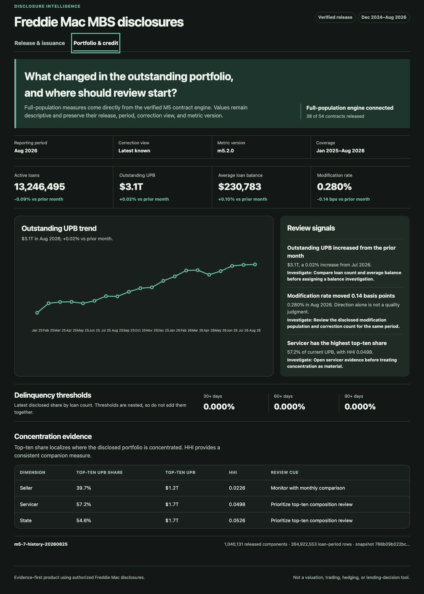

# Freddie Mac MBS Disclosure Intelligence

A governed MBS disclosure analytics product. The verified release processes official Freddie Mac disclosure files, reconciles every source row, and provides provider-neutral release, issuance, portfolio, credit, concentration, cohort, and investigation workflows. Power BI remains an optional parked client over the same governed contracts.



| Verified result | Baseline | Result |
| --- | ---: | ---: |
| Source-row reconciliation | 0% | 100% |
| Supported contract release | 0% | 100% (38 of 38) |
| Investigation evidence coverage | 0% | 100% (8 of 8) |
| M11 release-candidate acceptance | 0% | 100% (8 of 8) |

[Open the live product](https://vaibhavkhuranaaa.github.io/freddie-mac-mbs-disclosure-analytics/) or [download the complete data release](https://github.com/vaibhavkhuranaaa/freddie-mac-mbs-disclosure-analytics/releases/tag/data-v1).

## Verified baseline

- 19 issuance files from 2024-12 through 2026-06.
- 60,604 physical rows = 59,904 accepted/published + 700 documented status-`C` exclusions + 0 rejected + 0 duplicates.
- Two exact issuance schemas, including the December 2025 FICO/VS4 transition.
- 19 monthly aggregate rows and 95 term-family mix rows; 99.29% of issuance UPB is mapped and the remainder stays explicit.
- Active-data findings, resilient accessible states, source/build/schema/quality metadata, and a fail-closed release gate.

## Acquired implementation inputs

- 71 monthly-security archives: one December 2024 sample, all 48 applicable 2025 packages, and all 22 applicable 2026 packages through the August/March family endpoints.
- 35 monthly loan-level archives: 20 `fu` files through August 2026 and 15 `au` files through its March 2026 retirement, approximately 9.1 GiB compressed.
- Row-level use is authorized. Retention is seven years from acquisition, with earlier deletion if authorization ends.

These files remain outside Git history. M12 publishes the complete row-level source and derived release as integrity-checked GitHub Release assets.

Restricted files live outside this repository. By default, commands use sibling `../freddie-mac-mbs-disclosure-analytics-data`; set absolute `MBS_DATA_ROOT` to use another external location. Layout is `raw/`, immutable `releases/`, isolated `build/`, value-free `manifests/`, and recoverable `rollback/`. One atomic manifest pointer selects the active release.

## Verified M4 conformance

- Approved machine contracts govern 71 monthly-security and 35 loan-level archives across exact legacy, FICO/VS4, retirement, and April 2026 consolidation windows.
- 693,640,933 physical records reconcile to 274,162,591 accepted/published conformed rows and 419,478,342 explicit supplemental native-grain exclusions, with zero rejected, duplicate, or quarantined rows.
- Outputs contain 9,240,038 security-period and 264,922,553 loan-period facts. All loan joins are matched in the acquired population; unmatched, ambiguous, late, ineligible, and terminated behaviors remain golden-tested.
- M4 v2 populates all 45 approved field additions with provider code, sentinel, range, schema, applicability, and correction rules. Full, incremental, idempotence, stale-output, and active read-only checks pass against one immutable snapshot.

## Verified M5 metric engine

- Machine-readable catalog contains 54 contracts: 38 supported/implemented, 11 methodology-gated, 2 field-contract extensions, and 3 external families.
- SQLite output contains 1,040,131 released components. Disk-backed M5.7 history adds original/latest roll, cure, new-delinquency, and 12-month redefault measures without retaining a second loan-history dataset.
- All 35 loan partitions and 264,922,553 rows reconcile; both original/latest security views cover 9,240,038 rows.
- 1,816 segment, weighted, and transition checks plus 1,068 independent formula checks pass.
- Full external-path rebuild, incremental parity, and independent verification share one recorded release digest.
- Exact comparability and transition methodology is owner-approved, versioned as `m5-exact-methodology-v1`, and implemented. Remaining gated formulas stay unreleased until their implementation or source milestones pass.

## Verified storage boundary

- One external canonical set contains 125 checksummed archives; one active release contains issuance, M4, 35 loan partitions, and M5 outputs.
- Recovery ledger records every retained and removed file with size, checksum, producer, consumers, retention, recovery source, cleanup action, and final state. All destination checksums match; all classified recoverable or valueless files were removed.
- Product repository contains no physical analytical data, generated release, cache, bytecode, dated graph output, copied tool, stale prompt, or migrated legacy record.
- Active M5.7 stable storage is 45,675,380,656 bytes. Under approval `M5-STORAGE-BUDGET-EXCEPTION-2026-08-24`, the versioned ceiling is 43 GiB (46,170,898,432 bytes).
- Release `m5-7-history-20260825` is active. Its owner-approved superseded M5.6 rollback was permanently removed. Closure storage passes; a new full build must pass the separate headroom gate.

## Run locally

```sh
npm run check
npm run inventory:sources
npm run load:raw
npm run load:m4
npm run verify:m4
npm run load:m5
npm run verify:m5
npm run storage:check
npm run check
npm run build:product
npm run check:product
MBS_API_TOKEN='replace-with-at-least-16-characters' npm run serve:product
npm run serve
```

Open [http://127.0.0.1:4173](http://127.0.0.1:4173).

`npm run check` is non-destructive: it runs Python and dashboard tests, validates the released payload, and smoke-tests the static application. `npm run inventory:sources` records only safe archive/member/schema metadata. `npm run storage:close` validates one active release, zero residue, and the stable-storage ceiling; `npm run storage:check` also requires enough free space for another full build. `npm run load:raw` intentionally rebuilds the verified issuance release from authorized external files.

Full `load:m4` and `load:m5` commands write only to `MBS_DATA_ROOT/build/manual/`; they never replace the active release. Verification resolves the atomic active-release pointer. Promotion requires a complete fingerprinted bundle, full parity, read-only verification, and one atomic pointer switch.

## What this does not do

Implemented through M3: issuance UPB/count, corrections, official term-family composition, exact schemas, provenance, reconciliation, data-derived findings, and resilient UI states.

Implemented M5 boundary: all 38 supported contracts, additive numerator/denominator components, approved formulas, correction views, score/model/context separation, real-inventory reconciliation, bounded-memory streaming, and disk-backed loan-history transitions. M5 is complete on the owner-approved reduced DPR boundary. M7-M9 add the provider-neutral dashboard, persistent investigation workflow, and authenticated governed API over that release. M10 adds a disabled-by-default cited assistant that passed six fixed decision, citation, privacy, safety, latency, cost, and workflow cases. M11 adds a verified, Entra-authenticated Azure release candidate with recovery, observability, load, rollback, cost, and teardown evidence; no cloud endpoint remains active. Eleven methodology-gated, two field-extension, and three external contracts remain explicitly unreleased. M6 Power BI work is parked; M12 full-data publication remains separately gated.

The [BI product specification](docs/BI_PRODUCT_SPEC.md) defines the pages, industry metric catalog, semantic model, visuals, user experience, governance, and history recommendation. [Scope](docs/scope.md) records implemented and planned boundaries.

The project does not make borrower, investment, valuation, trading, hedging, or unsupported causal decisions. It does not release methodology-gated or external-data metrics, enable the cited assistant publicly, expose public mutation APIs, or claim production availability.

## Project records

- `PROJECT.md`: business and scope contract
- `DESIGN.md`: BI visual, interaction, language, and accessibility rules
- `docs/BI_PRODUCT_SPEC.md`: complete decision product and metric specification
- `docs/architecture.md`: current and target system design
- `docs/scope.md`: implemented, gated, and excluded capabilities
- `docs/data-dictionary.md`: grains, fields, classifications, and release boundaries
- `docs/metric-glossary.md`: governed measure definitions and limitations
- `contracts/`: versioned machine source and metric contracts
- `DATASET.md`: complete public data-release contents and verification
- `CASE-STUDY.md`: current verified result and target value
