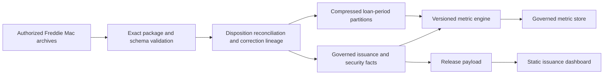
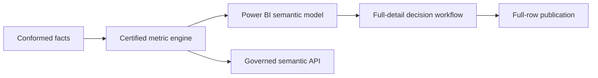
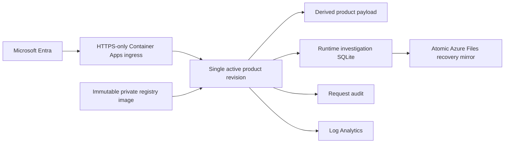

# Architecture

## Current system

Python transformations enforce source contracts, validity windows, duplicate rules, explicit row dispositions, correction precedence, and reproducible backfill or incremental behavior. SQLite stores control and security facts. Loan facts remain in compressed period and source partitions so the engine can scan hundreds of millions of rows with bounded memory. The metric layer consolidates exact additive components, emits only catalog-supported formulas, and independently recomputes approved HHI, delinquency-threshold, modification-rate, involuntary-removal-share, and loan-transition outputs.

M5.7 uses one temporary disk-backed stage with current/prior identity slices and open redefault cohorts. Identity is `(source_family, loan_id, security_id)`; source-family changes break continuity. Original and latest precedence resolve independently. Attrition remains in beginning denominators, while incomplete 12-month cohorts are counted and excluded from redefault denominators. Only compact transition components persist in the immutable release; the temporary identity store is deleted.

Restricted storage resolves from `MBS_DATA_ROOT`, with an external `raw/` canonical archive set, immutable `releases/`, isolated `build/` paths, recoverable `rollback/`, and value-free `manifests/`. One atomic manifest pointer selects the active release. Storage preflight rejects repository analytical data, duplicate active release state, temporary residue, unapproved rollback residue, or insufficient build headroom.

M5.7 verified active release `m5-7-history-20260825` across 125 canonical archives, 106 M4 sources, 35 loan partitions, and the M5 metric store. Stable storage is 45,675,380,656 bytes under the approved 43 GiB ceiling. M4 and M5.7 remain byte-stable against their recorded release digests. The 5,817,237,504-byte history workspace and the owner-approved superseded M5.6 rollback are removed. Closure storage passes with one active release and zero temporary files. A new full build retains a separate headroom gate.

## Data boundaries

- Raw archives, row-level facts, databases, and metric components remain outside Git history and are published as immutable GitHub Release assets.
- `contracts/` contains value-free source and metric contracts required to reproduce validation and calculations.
- Current dashboard payload is an implemented product slice, not a separate publication boundary.
- The `data-v1` publication includes the complete approved row-level source and derived data with a manifest of asset sizes and SHA-256 digests.

## Target system

Decision 0018 parks M6 until a Windows Power BI Desktop runtime is available. M7-M9 are complete through provider-neutral web and investigation contracts plus an authenticated governed API over the verified M5 engine. Decision 0019 completes the bounded cited-assistant evaluation with canonical provider inputs, exact evidence validation, deterministic prose, and a disabled-by-default runtime route. Decision 0020 verifies and tears down the private Azure release candidate. M12 publishes the static product on GitHub Pages and the complete approved row-level source and derived data as verified GitHub Release assets. Power BI remains resumable against the same contracts.

## Verified cloud release-candidate pattern

The verified release candidate used a consumption environment with scale-to-zero and a one-replica maximum. SQLite ran on container-local storage because direct SMB database access failed under live locking. Every committed write copied a closed, consistent database file to the durable share; a stopped-and-started revision restored the exact recorded recovery point. All cloud and identity resources were deleted after evidence capture.

## Scale triggers

- Keep the current Python, SQLite, and compressed-partition stack while refresh time, query latency, and storage remain within measured needs.
- Add an analytical engine only when M5 or M6 evidence shows a specific performance limit.
- Add incremental refresh only after boundary, correction, and late-arriving tests pass.
- Provision cloud infrastructure only after provider, identity, residency, recovery, budget, and teardown approval.

## Failure behavior

- Unknown package, member, schema, period, type, or duplicate condition blocks publication.
- Every physical record receives an explicit accepted, excluded, rejected, duplicate, quarantined, or published disposition.
- The current acquired population must have zero ambiguous, ineligible, late, terminated, or unmatched loan joins; golden fixtures retain coverage for those fail-closed edge classifications.
- Missing or invalid metric denominators suppress output instead of emitting a misleading value.
- Unapproved field, methodology, external source, or release mode remains unreleased.
