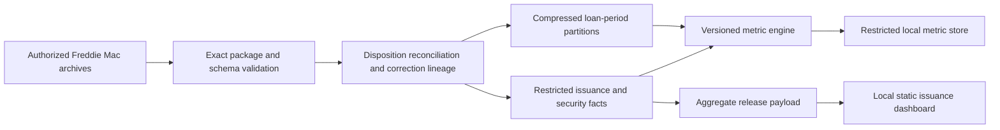
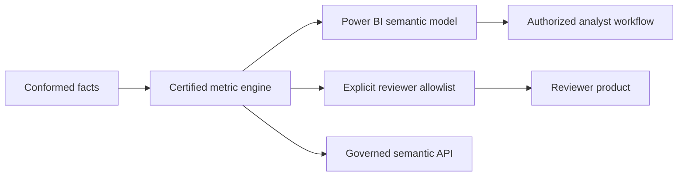

# Architecture

## Current system

Python transformations enforce source contracts, validity windows, duplicate rules, explicit row dispositions, correction precedence, and reproducible backfill or incremental behavior. SQLite stores control and security facts. Loan facts remain in compressed period and source partitions so the engine can scan hundreds of millions of rows with bounded memory. The metric layer consolidates exact additive components, emits only catalog-supported formulas, and independently recomputes approved HHI, delinquency-threshold, modification-rate, and involuntary-removal-share outputs before restricted-local release.

## Data boundaries

- Raw archives, row-level facts, local databases, and restricted metric components remain outside Git.
- `contracts/` contains value-free source and metric contracts required to reproduce validation and calculations.
- Current dashboard payload contains governed aggregates only.
- Authorized analyst detail does not imply reviewer or public redistribution rights.

## Target system

M6 adds a Power BI Import star schema with explicit measures, single-direction relationships, original and latest correction views, and restricted-detail controls. M7 and M8 add the trust-to-investigation pages. API, AI, cloud, deployment, and publication remain later approval gates.

## Scale triggers

- Keep local Python, SQLite, and compressed partitions while refresh time, query latency, and storage remain within measured needs.
- Add an analytical engine only when M5 or M6 evidence shows a specific performance limit.
- Add incremental refresh only after boundary, correction, and late-arriving tests pass.
- Provision cloud infrastructure only after provider, identity, residency, recovery, budget, and teardown approval.

## Failure behavior

- Unknown package, member, schema, period, type, or duplicate condition blocks publication.
- Every physical record receives an explicit accepted, excluded, rejected, duplicate, quarantined, or published disposition.
- Missing or invalid metric denominators suppress output instead of emitting a misleading value.
- Unapproved field, methodology, external source, or release mode remains unreleased.
